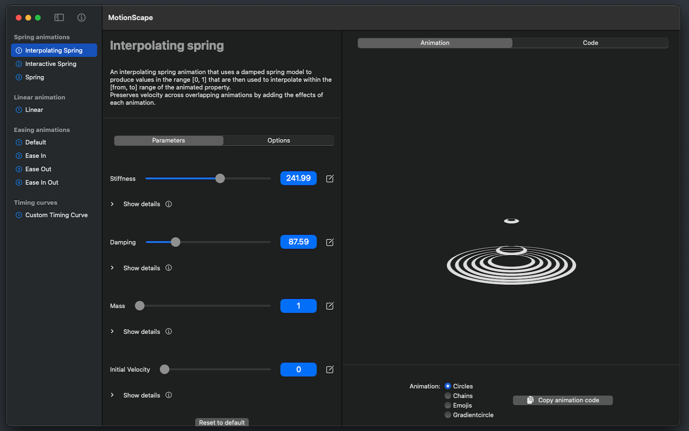
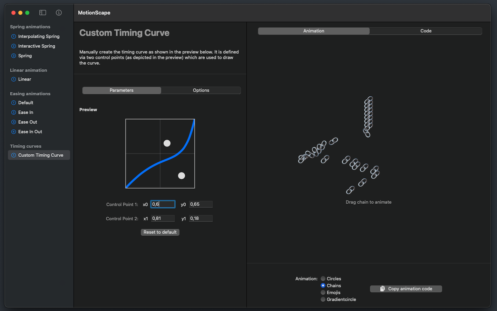
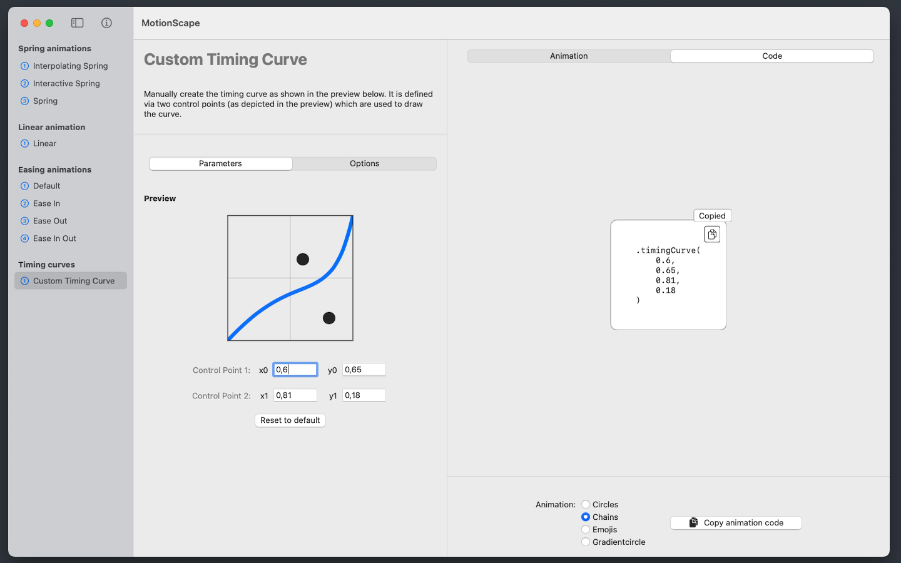

# MotionScape

<section style="display:flex;justify-content:center;max-width:75ch;margin-left:auto;margin-right:auto">
    
    

        <h2 style="border-bottom:none">MotionScape</h2>
        
    

</section>

MotionScape is your animations playground as a developer. You can see all animations and their parameters in effect with beautifully designed and handcrafted animation examples.

Get help with custom descriptions of all parameters that help you bring light into the dark tunnel of confusing namings and concepts.

Best of all: directly preview and export your settings as production-ready SwiftUI code that you can use in your apps as-is.

Supercharge your apps with animations and get to know how to use them - with MotionScape!

## Animation Examples

## Screenshots

