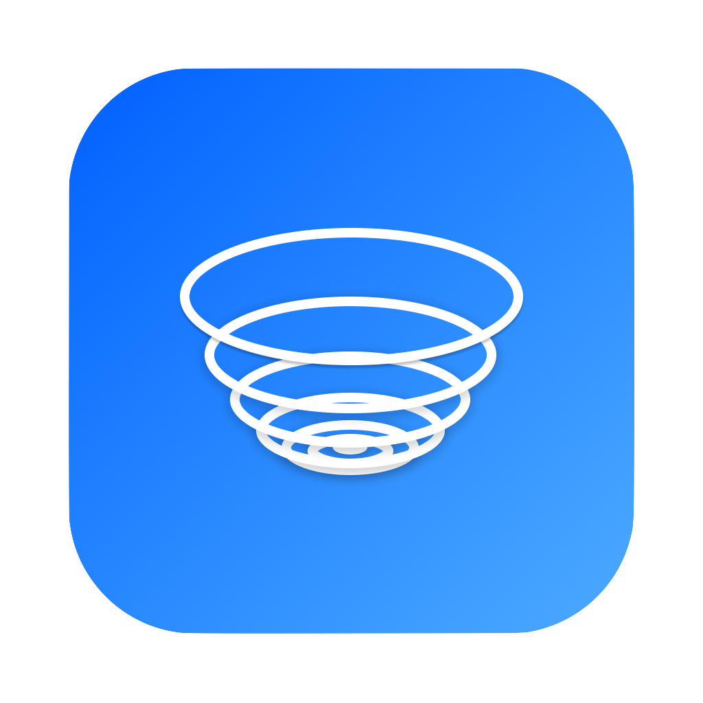

# MotionScape

<section style="display:flex;justify-content:center;max-width:75ch;margin-left:auto;margin-right:auto">
    
    

        <h2 style="border-bottom:none">MotionScape</h2>
        
    

</section>

Prototype, test, and copy animation easings code for your next SwiftUI animations.
