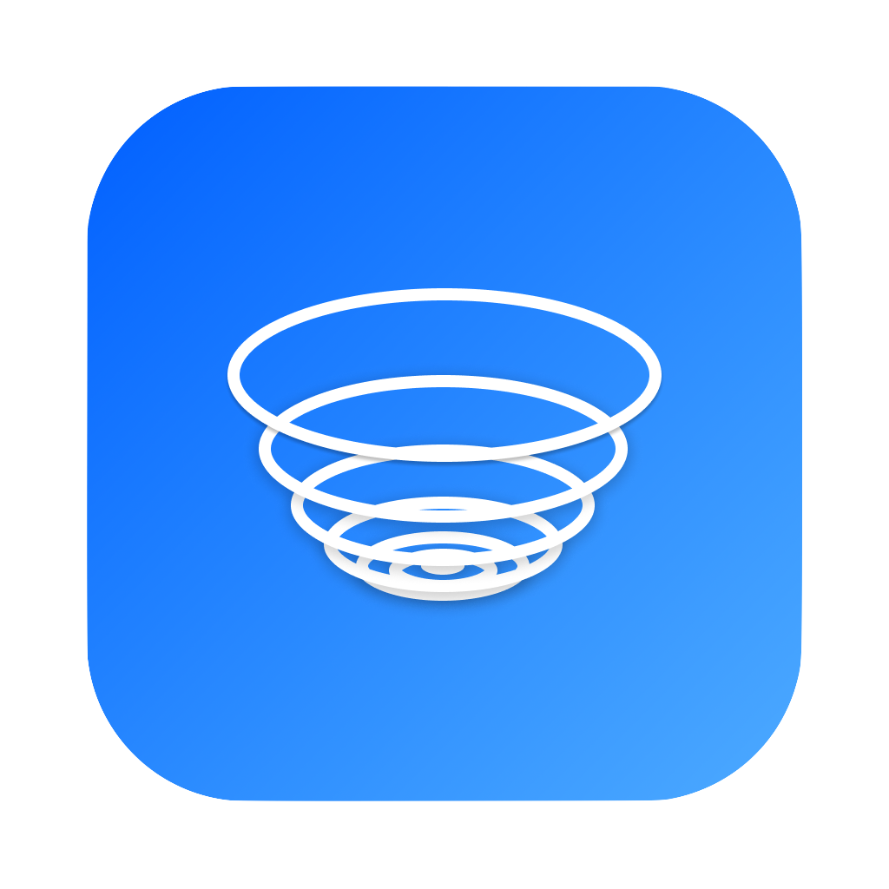
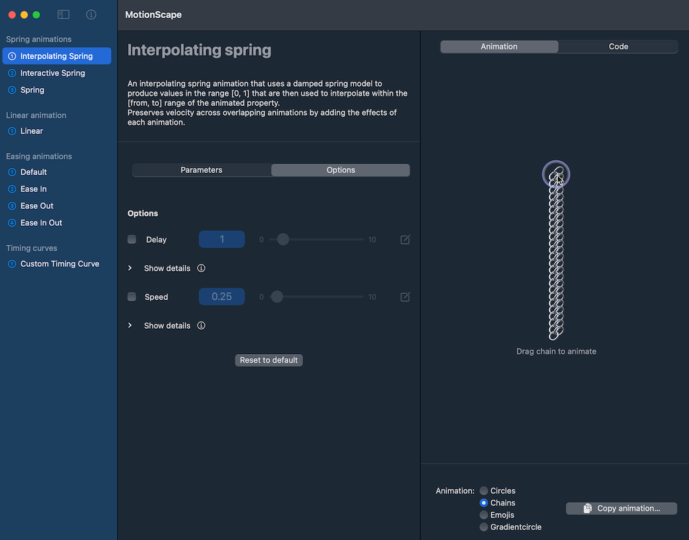
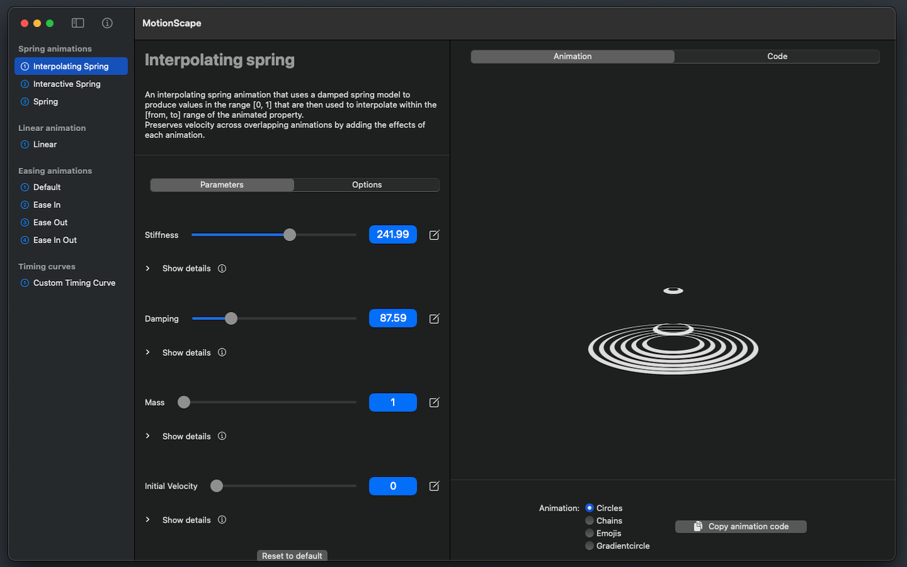
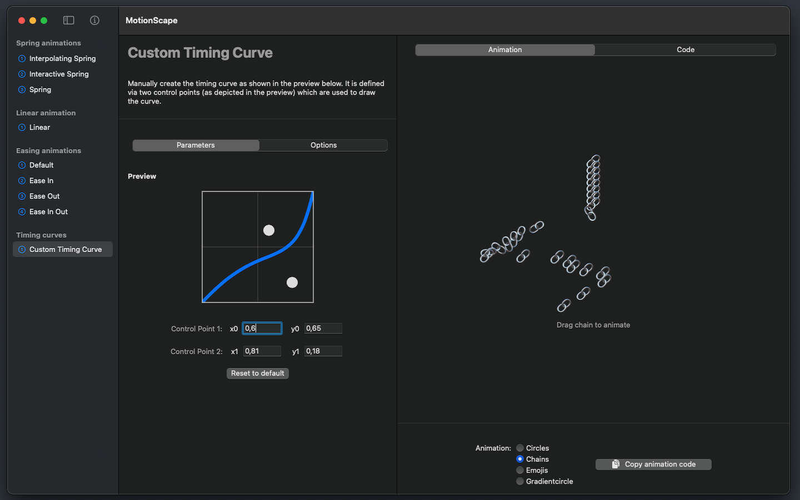
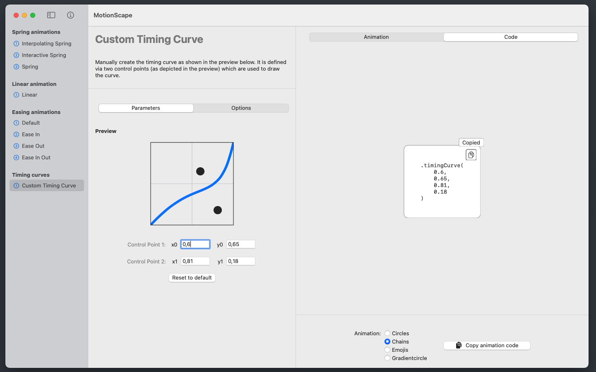
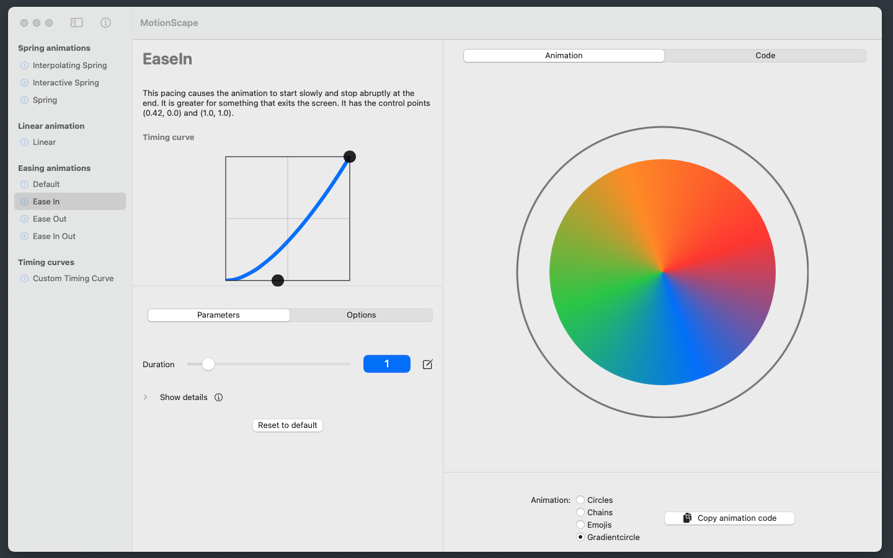

<section style="display:flex;justify-content:space-around">
    
    

        <h2 style="border-bottom:none">MotionScape</h2>
        
    

</section>

<section style="max-width:75ch;margin-left:auto;margin-right:auto">
    <h2>Preview videos</h2>
    

        
        
        
        
    

</section>

<section style="max-width:75ch;margin-left:auto;margin-right:auto;">
    <h2>What is MotionScape?</h2>
    

    MotionScape is your animations playground as a developer. You can see
    all animations and their parameters in effect with beautifully designed
    and handcrafted animation examples.
    

    

    Get help with custom descriptions of all parameters that help you bring
    light into the dark tunnel of confusing namings and concepts.
    

    

    Best of all: directly preview and export your settings as
    production-ready SwiftUI code that you can use in your apps as-is.
    

    

    Supercharge your apps with animations and get to know how to use them -
    with MotionScape!
    

</section>

<section style="max-width:75ch;margin-left:auto;margin-right:auto">
    <h2>Screenshots</h2>
    

        
        
        
        
    

</section>

<section style="max-width:75ch;margin-left:auto;margin-right:auto;" id="#privacy">
    <h2>Privacy policy</h2>
    
We do not collect, use, save, or have access to any of your personal data in MotionScape.

    
Also, we do not use any kind of tracking software or analytics that might lead to the collection of data from third parties.

    <!-- 
In order to make this transparent, the entire source code of the app is open-source and <a href="https://github.com/GetStream/motionscape-app">you can find it on Github to inspect.</a>
 -->
</section>
